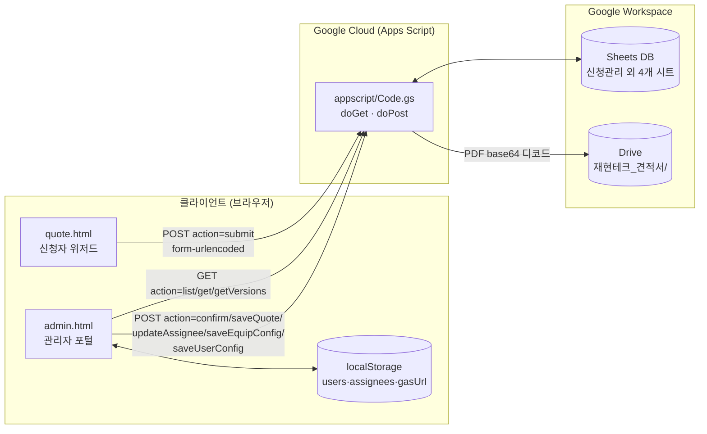
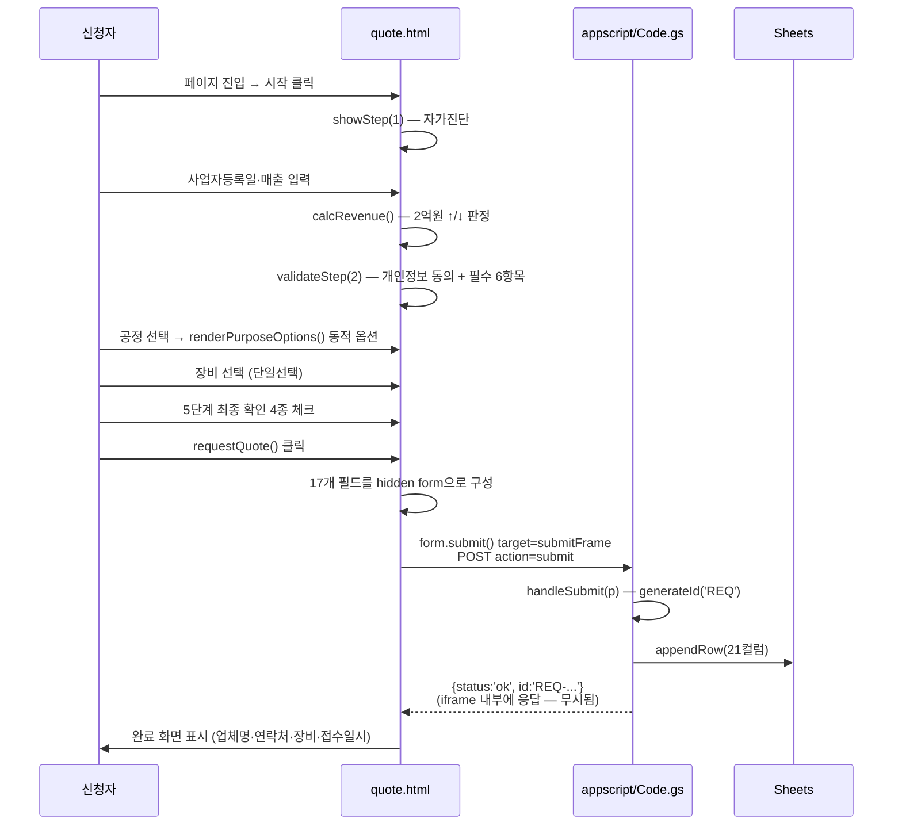
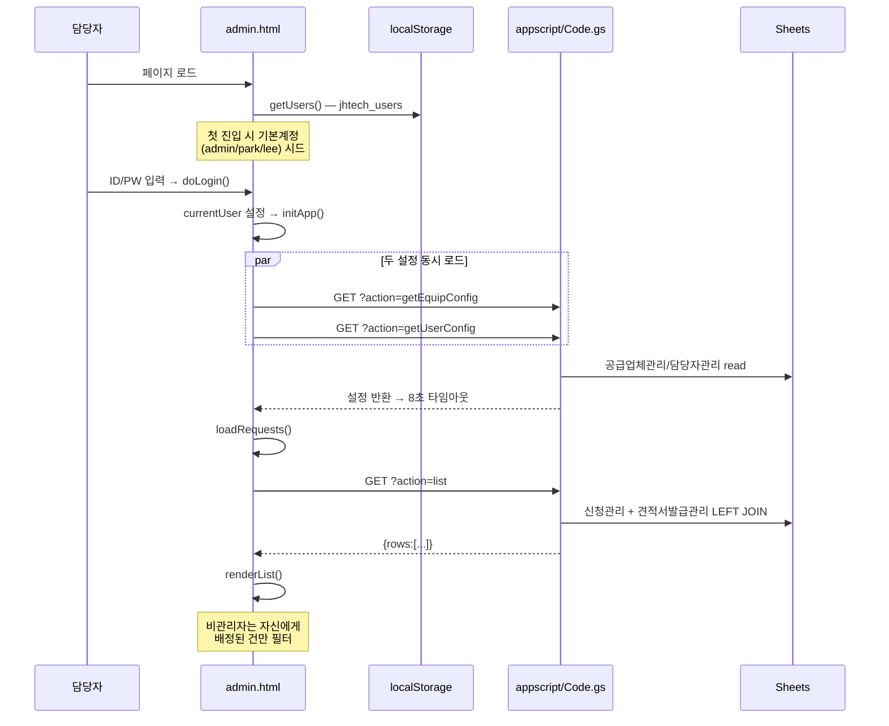
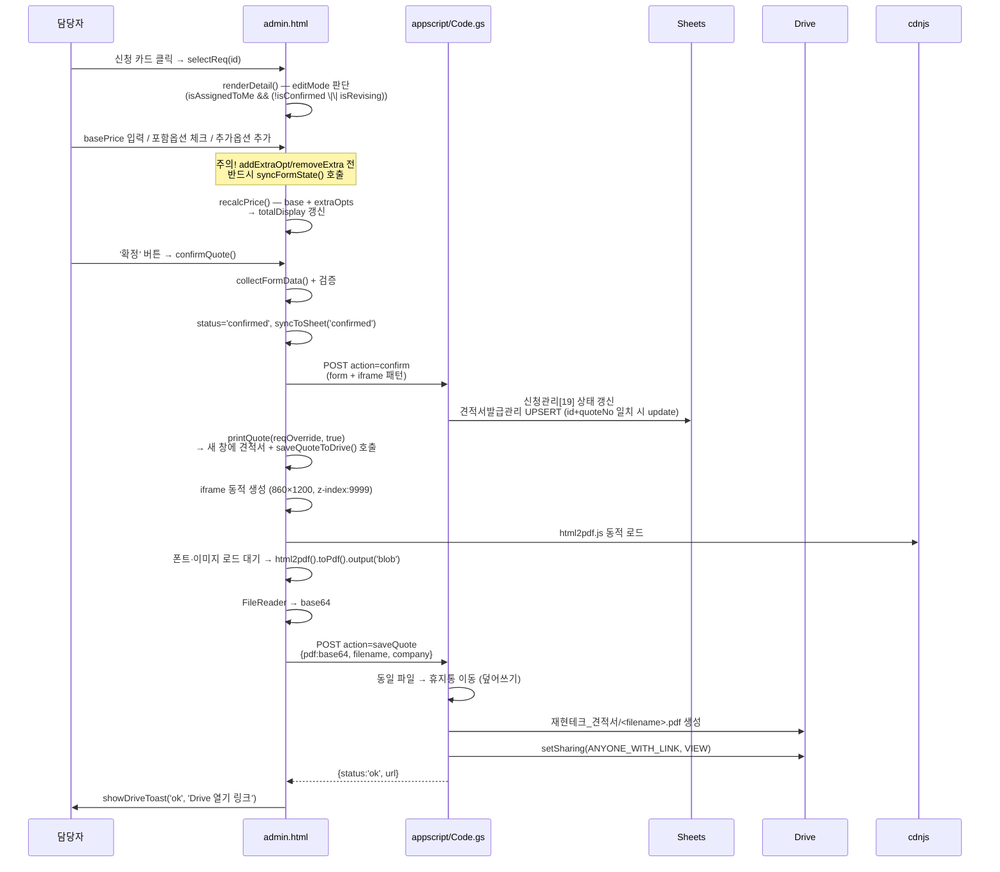
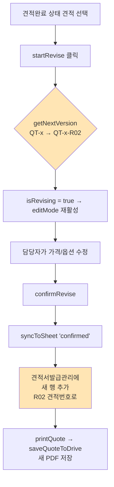

# jhtechsmart 코드 분석 보고서

> 분석일: 2026-05-11
> 분석 대상: `quote.html` (592줄), `admin.html` (1742줄), `appscript/Code.gs` (415줄)
> 분석자: Claude (Opus 4.7)

---

## 1. 한눈에 보는 시스템

(주)재현테크의 **2026 소공인 스마트제조 지원사업 견적 신청·관리 시스템**. 신청자가 GitHub Pages의 정적 페이지에서 5단계 신청서를 제출하면 Google Apps Script(GAS)가 Google Sheets에 저장하고, 관리자가 별도 정적 페이지에서 견적서를 작성·확정해 PDF를 Google Drive에 자동 보관한다.

### 1.1 기술 스택

| 계층 | 기술 |
|---|---|
| **프런트엔드** | 순수 HTML5 + CSS + Vanilla JS (프레임워크/번들러 없음) |
| **폰트/CDN** | Pretendard (jsDelivr), html2pdf.js 0.10.1 (cdnjs) |
| **백엔드** | Google Apps Script (V8 런타임) — `doGet`/`doPost` Web App |
| **데이터베이스** | Google Sheets — 시트 4개 (`신청관리`, `견적서발급관리`, `공급업체관리`, `담당자관리`) |
| **파일 저장소** | Google Drive — `재현테크_견적서/` 폴더 |
| **호스팅** | GitHub Pages (`jhtechsmart-cloud.github.io/jhtechsmart`) |
| **빌드/테스트** | 없음 — 파일 편집 → git push → 자동 배포 |

### 1.2 시스템 구성도



### 1.3 핵심 데이터 모델

GAS의 `appscript/Code.gs::initSheets()`가 시트 스키마를 생성한다.

| 시트 | 컬럼수 | 의미 | 핵심 컬럼 |
|---|---:|---|---|
| 신청관리 | 21 | 신청자가 제출한 원본 데이터 | `[0]접수번호`, `[18]상태`, `[19]담당자`, `[20]공정흐름도` |
| 견적서발급관리 | 13 | 발급된 견적서 (재발행 시 새 행 추가) | `[0]견적번호`, `[1]접수번호`, `[11]상태`, `[12]담당자` |
| 공급업체관리 | 6 | 장비 카탈로그 (가격·옵션) | `[0]장비ID`, `[3]기본공급가액`, `[4]포함옵션(\| 구분)`, `[5]추가옵션(JSON)` |
| 담당자관리 | 7 | 사용자 계정 (이름/직책/전화/이메일/**비밀번호 평문**/관리자여부) | `[5]비밀번호`, `[6]관리자여부` |

ID 형식 (`appscript/Code.gs::generateId()`): `REQ-YYYYMMDD-NNNNN`(신청), `QT-YYYYMMDD-NNNNN`(견적). 견적 재발행은 `-R02`, `-R03` 접미사 부여 (`admin.html::getNextVersion()`).

---

## 2. 주요 사용자 시나리오 코드 흐름

### 2.1 시나리오 A — 신청자가 견적을 신청한다

**진입점:** `quote.html` (외부 링크/카카오톡 공유로 진입)



**핵심 코드 위치:**
- 5단계 검증: `quote.html::validateStep(n)` (line 373)
- 최종 제출: `quote.html::requestQuote()` (line 560)
- 백엔드 처리: `appscript/Code.gs::handleSubmit(p)` (line 107)

**주의 포인트:**
- 응답은 숨김 iframe(`<iframe name="submitFrame">`)에 들어가므로 클라이언트에서 접수번호를 받을 수 없다. 완료 화면은 **GAS 응답을 기다리지 않고** 즉시 띄움 → 실패 시에도 사용자는 성공으로 인지 가능 ⚠️
- `<추측>` 이는 fetch + CORS 회피 대신 form submit + iframe 패턴을 택한 결과로 보인다. JSONP를 쓰면 응답 캡처가 가능하지만 채택하지 않은 이유는 불명.

### 2.2 시나리오 B — 담당자가 신청 목록을 본다

**진입점:** `admin.html` 로그인



**핵심 코드 위치:**
- 로그인 시드: `admin.html::initApp()` (line 529)
- 목록 조회: `admin.html::loadRequests()` (line 585)
- 비관리자 필터: `admin.html::renderList()` line 618 — `if(currentUser && !currentUser.isAdmin) base = base.filter(r => r.assignee === currentUser.id)`
- 백엔드 JOIN: `appscript/Code.gs::listRequests()` (line 201) — `quoteMap`으로 견적 데이터를 접수번호 키로 매핑 후 신청 행에 머지

### 2.3 시나리오 C — 담당자가 견적서를 작성·확정한다 (가장 복잡한 흐름)



**핵심 코드 위치:**
- 편집 권한: `admin.html::renderDetail()` (line 718) — `editMode = isAssignedToMe && (!isConfirmed || isRevising)`
- 확정 트리거: `admin.html::confirmQuote()` (line 1020)
- 시트 동기화: `admin.html::syncToSheet()` (line 1032) — assigneeName 결정 로직: `assignedUser || currentUser`
- PDF 생성: `admin.html::saveQuoteToDrive()` (line 1073)
- Drive 저장: `appscript/Code.gs::handleSaveQuote()` (line 380) — 같은 이름 파일은 휴지통으로 이동 후 재생성 (=덮어쓰기)

**파일명 규칙:**
- 견적서: `견적서_<업체명>.pdf` (`/[\s\/\\:*?"<>|]/g` → `_` 치환)
- 장비사진: `장비사진_<업체명>.pdf`
- ⚠️ 작업내역.md 11차 작업에는 파일명이 `업체명_YYYYMMDD.pdf`이고 저장 위치가 `재현테크_견적서/YYYY-MM/`로 기록되어 있으나, **현재 코드는 그렇지 않다** (날짜 미포함, 서브폴더 없음). 그 이후 작업(eaad860 "Drive 덮어쓰기")에서 변경된 듯하다.

### 2.4 시나리오 D — 견적 재발행 (R02 버전)



**버전 이력 저장처가 두 곳:**
1. **localStorage** `jhtech_quote_versions` — `pushVersionHistory()` (line 1209) 로 클라이언트 스냅샷 저장. 다른 기기에서는 안 보임.
2. **Google Sheets `견적서발급관리`** — `appscript/Code.gs::getVersions(reqId)` (line 244)로 접수번호 기준 모든 견적번호 조회 가능.

`<추측>` 둘 다 쓰는 이유는 GAS 도입 전에 만들어진 localStorage 버전 이력을 그대로 남겨둔 것으로 보임. 향후 단일화 검토 필요.

### 2.5 시나리오 E — 관리자가 담당자를 배정한다

```mermaid
flowchart LR
  L[관리자 로그인] --> SEL[신청 카드 선택]
  SEL --> DD[담당자 드롭다운에서 선택]
  DD --> SAVE[저장 클릭]
  SAVE --> CALL["POST action=updateAssignee<br/>{id, assignee}"]
  CALL --> GS["appscript/Code.gs::handleUpdateAssignee()"]
  GS --> UPD[신청관리[20] 컬럼 갱신]
  UPD --> AC[admin.html: 저장 → 수정 버튼 토글]
  AC --> P[해당 담당자 로그인 시<br/>renderList 필터에 노출]
```

**우선순위 규칙** (`admin.html::saveAssignee()` 부근):
1. 시트 데이터 (`r.assignee`) — 우선
2. localStorage (`jhtech_assignees`) — 폴백
3. 빈값

---

## 3. 통신 프로토콜 정리

### 3.1 GAS Web App 엔드포인트

| 메서드 | action | 호출처 | 역할 |
|---|---|---|---|
| POST | `submit` | quote.html | 신청 접수 → REQ ID 발급 |
| POST | `confirm` | admin.html | 견적 확정 → 신청관리 상태 + 견적서발급관리 UPSERT |
| POST | `saveQuote` | admin.html | PDF base64 → Drive 저장 (덮어쓰기) |
| POST | `updateAssignee` | admin.html | 담당자 배정 |
| POST | `saveEquipConfig` | admin.html | 장비 카탈로그 저장 |
| POST | `saveUserConfig` | admin.html | 사용자 계정 저장 |
| GET | `list` | admin.html | 신청관리 + 견적 LEFT JOIN |
| GET | `get?id=...` | (현재 미사용으로 보임) | 단건 조회 |
| GET | `listQuotes` | (현재 미사용으로 보임) | 견적 전체 조회 |
| GET | `getEquipConfig` | admin.html initApp | 장비 카탈로그 조회 |
| GET | `getUserConfig` | admin.html initApp | 사용자 계정 조회 |
| GET | `getVersions?id=...` | admin.html | 특정 신청의 견적 버전 이력 |

### 3.2 CORS 회피 방식

모든 POST는 `Content-Type: application/x-www-form-urlencoded`로만 전송한다 (또는 form submit + iframe). JSON content-type을 쓰면 CORS preflight가 발생하여 GAS Web App에서 실패한다. **신규 POST 추가 시 동일 패턴을 지킬 것.**

GET은 `?callback=xxx` 파라미터로 JSONP를 지원하지만 현재 클라이언트는 이를 사용하지 않고 일반 fetch + JSON 응답을 사용한다.

### 3.3 GAS URL 단일 진실 소스 (2026-05-11 적용)

```
config.js                →  window.JHTECH_GAS_URL = 'AKfycbwuHdUnuGci...'   ← 유일한 정의
quote.html line 343      →  const APPS_SCRIPT_URL = window.JHTECH_GAS_URL || '';
admin.html line 344      →  const GAS_URL_DEFAULT = window.JHTECH_GAS_URL || '';
```

두 HTML은 `<script src="config.js"></script>`로 외부 설정을 먼저 로드한 후 위 상수를 참조한다. 새 GAS 배포 시 **`config.js` 한 파일만 수정**하면 양쪽에 즉시 반영된다.

`admin.html`은 추가로 localStorage `gasUrl` 또는 설정 화면 입력값으로 사용자 오버라이드를 지원한다 (폴백 우선순위: 입력값 → localStorage → `config.js`).

> 변경 이력: 분리 이전에는 두 HTML에 URL이 분산 하드코딩되어 있었고, 동기화 누락으로 `quote.html`만 옛 GAS를 가리키는 사고가 발생했음. 자세한 경위는 `docs/issues.md` 문제 1 참조.

---

## 4. 보안 분석

| 항목 | 현재 상태 | 위험도 |
|---|---|---|
| 인증 | 클라이언트 측 비밀번호 비교 (`doLogin()` 가 `users.find(u=>u.id===id && u.pw===pw)`) | 🔴 높음 — 페이지 소스에서 비밀번호 추출 가능 |
| 비밀번호 저장 | localStorage 평문 + Google Sheets `담당자관리` 평문 | 🔴 높음 |
| 권한 분리 | 백엔드에서 호출자 검증 없음. action만 알면 누구나 호출 가능 | 🔴 높음 — 정적 페이지 우회 가능 |
| 시트 접근 | `SPREADSHEET_ID` 코드 노출. 다만 GAS 토큰으로만 접근 | 🟡 중간 |
| 법인도장 | `.gitignore`로 제외, 로컬에만 존재 | 🟢 양호 |
| Drive 공유 | `ANYONE_WITH_LINK VIEW` — URL 유출 시 견적 노출 | 🟡 중간 |
| 신청 검증 | 클라이언트만 `validateStep`. GAS는 검증 없이 그대로 저장 | 🟡 중간 |

`<추측>` 사내 단일 PC + 신뢰 환경 전제로 설계된 시스템이라면 위 위험은 수용 가능. 외부 공유/공용 PC 사용 가능성이 있다면 GAS Web App의 `Session.getActiveUser()` 또는 별도 토큰 도입 검토 필요.

---

## 5. 추가 확인이 필요한 5가지 질문

### Q1. 두 GAS URL이 다릅니다 — 의도된 분리인가요?

```
quote.html → AKfycbzcl9GZ--OaM7DkcxYcteRbE843Jnq75KnfipLuD7ixBBRXnOxCuQuTZB96eWSwrxhl
admin.html → AKfycbwuHdUnuGci3QTkPg1G75WCmHM-N3teWyyWuY72_09NMza-QSH8zIsHhVuz8zimTk0j
```

두 페이지가 **다른 GAS 배포**를 가리키고 있습니다. 가장 최근 commit(`1aaad3b "config: GAS 배포 URL 업데이트"`)에서 한쪽만 갱신된 결과인지, 아니면 신청용/관리용 GAS를 의도적으로 분리한 것인지 확인해야 합니다. 만약 후자라면 그 분리 이유와 시트 접근 정책을 문서화할 필요가 있습니다. 만약 동기화 누락이라면 둘 중 어느 URL이 최신 시트 스키마를 반영하는지 확인 후 통일해야 합니다.

### Q2. PDF 저장 경로/파일명이 작업내역.md 기록과 다릅니다 — 어느 쪽이 정상인가요?

- 작업내역.md 11차 작업: `재현테크_견적서/YYYY-MM/업체명_YYYYMMDD.pdf`
- 현재 `appscript/Code.gs::handleSaveQuote()`: `재현테크_견적서/견적서_업체명.pdf` (날짜·서브폴더 없음)

월별 폴더링과 날짜 접미사가 의도적으로 제거된 것이라면 (커밋 `eaad860 "Drive 덮어쓰기"`가 그 변경으로 보임) 작업내역.md를 갱신해야 하고, 의도치 않은 회귀라면 복구해야 합니다. 현재는 동일 업체가 같은 견적의 R02 버전을 발행해도 같은 파일명으로 덮어쓰기됩니다 (드라이브에는 항상 1개 파일만 남음).

### Q3. 신청 제출 응답을 클라이언트가 받지 못하는 구조입니다 — 의도된 것인가요?

`quote.html::requestQuote()`는 hidden form + iframe(`submitFrame`)으로 제출하고, 응답을 읽지 않은 채 즉시 완료 화면을 띄웁니다. GAS 호출이 실패하거나 시트 권한 오류가 나도 신청자는 "성공"으로 인지합니다. 실제로 누락되는 신청이 있는지 확인하셨나요? 신청 후 관리자 시트에 안 들어오는 사례가 보고된 적이 있다면 fetch + JSON 응답으로 바꾸거나 (CORS 설정 필요), 신청 직후 `getRequest(id)`로 확인하는 방어 로직 추가가 필요합니다.

### Q4. 비관리자(`isAdmin=false`)의 GAS Write 권한을 백엔드에서 검증하지 않습니다 — 의도된 신뢰 모델인가요?

현재 `admin.html`은 클라이언트에서 `currentUser.isAdmin`을 보고 UI를 가리지만, GAS 측 `handleConfirm`/`handleSaveQuote`/`handleUpdateAssignee`/`handleSaveEquipConfig`/`handleSaveUserConfig` 등 어떤 핸들러도 호출자 식별을 하지 않습니다. 누구나 GAS URL만 알면 모든 데이터를 수정할 수 있습니다 (URL은 페이지 소스에 노출). 사내망 신뢰 환경이면 수용 가능하지만, 외부 인터넷에 GitHub Pages로 노출되어 있다는 점을 고려하면 위험합니다. **공유 비밀(shared secret) 토큰을 form 데이터에 함께 보내고 GAS에서 검증**하는 것이 가장 적은 변경으로 추가 가능한 방어선입니다. 이 모델이 충분한지 결정해주세요.

### Q5. 견적 버전 이력이 localStorage와 Sheets에 이중으로 저장됩니다 — 어느 쪽이 진실 소스(SoT)인가요?

`admin.html::pushVersionHistory()` (localStorage `jhtech_quote_versions`)와 `appscript/Code.gs::getVersions()` (Sheets `견적서발급관리`)가 모두 버전 이력을 보존합니다. 다른 PC에서 admin에 로그인하면 localStorage 이력은 보이지 않고 시트 이력만 보이므로, 표시 결과가 환경마다 달라집니다. 이력 표시 화면(`renderVersionHistory()` line 683)은 어느 쪽을 우선 사용하나요? localStorage 이력을 완전히 제거해도 운영에 문제가 없을지 검토가 필요합니다.

---

## 6. 부록 — 함수 인덱스 (자주 참조하는 항목)

### `quote.html`
| 함수 | 라인 | 역할 |
|---|---:|---|
| `validateStep(n)` | 373 | 단계 전환 검증 (next 버튼 + step-tab 양쪽) |
| `calcRevenue()` | 382 | 평균매출 계산 (2억원 ↑/↓ 판정 — `>=` 부등호 주의) |
| `renderEquip()` | 385 | 장비 카탈로그 카테고리별 렌더링 |
| `renderPurposeOptions()` | 456 | 공정×목적 조합으로 동적 체크박스 생성 |
| `buildSummary() / buildPlainText()` | 461/513 | HTML 요약 + 다운로드용 텍스트 분리 |
| `requestQuote()` | 560 | 최종 제출 (form+iframe) |

### `admin.html`
| 함수 | 라인 | 역할 |
|---|---:|---|
| `doLogin()` | 495 | 클라이언트 측 ID/PW 비교 |
| `initApp()` | 529 | 부팅 시 GAS 설정 + 사용자 시드 |
| `loadRequests()` | 585 | GAS list 호출 |
| `renderList()` | 612 | 비관리자 필터 + 카드 렌더링 |
| `selectReq()` → `renderDetail()` | 660 / 718 | 상세 화면 + editMode 판정 |
| `syncFormState()` | 922 | 추가옵션 변경 전 DOM 상태 보존 (필수) |
| `recalcPrice()` | 953 | base + extraOpts 합산 |
| `confirmQuote()` | 1020 | 확정 트리거 |
| `syncToSheet(status)` | 1032 | GAS confirm 호출 |
| `saveQuoteToDrive()` | 1073 | iframe + html2pdf → base64 → GAS |
| `printQuote()` | 1321 | 새 창 출력 + Drive 저장 호출 |
| `getNextVersion()` | 1217 | `QT-x → QT-x-R02 → -R03` 증가 |

### `appscript/Code.gs`
| 함수 | 라인 | 역할 |
|---|---:|---|
| `initSheets()` | 9 | 4개 시트 초기화 (수동 1회 실행) |
| `generateId(prefix)` | 83 | `REQ-`/`QT-` ID 생성 |
| `doPost(e)` | 90 | action 라우터 (POST) |
| `doGet(e)` | 175 | action 라우터 (GET, JSONP 지원) |
| `handleSubmit(p)` | 107 | 신청 행 추가 |
| `handleConfirm(data)` | 127 | 신청 상태 갱신 + 견적서 UPSERT |
| `listRequests()` | 201 | 신청 + 견적 LEFT JOIN |
| `handleSaveQuote(data)` | 380 | base64 → Drive PDF |
| `handleUpdateAssignee(data)` | 365 | 신청관리 20번 컬럼 갱신 |
